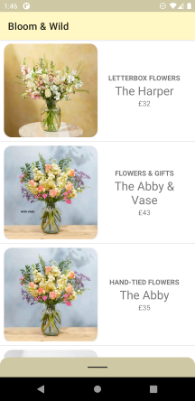
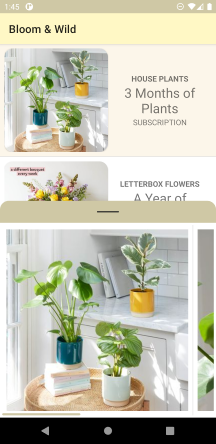
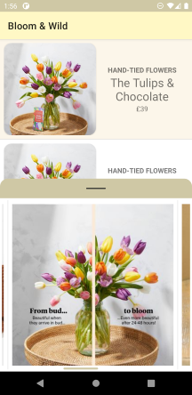
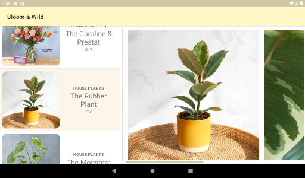

# Bloom & Wild

   

## 📐 Architecture

Different layouts have been designed to support *portrait smartphones* and *landscape tablets*. The pictures displayed in tablets are of bigger resolution (`720` vs `360`).

This project uses Kotlin & Java. It's pieced together with MMVM & LiveData. `View`s are handled with View Binding.

Data is managed through Repository Pattern, which allows to sanitise the data coming from the API and eases displaying it. In this case, the price and pictures' URLs were adjusted. 

These adjustments are done with Controllers. Controllers hold the logic to correctly transform the data. 

Dependencies are Injected manually without any framework.

The App consists of 2 `Fragments` displayed together: *Main* (the list) & *Detail* (the picture carousel). These 2 pages are communicated so that the *Detail* page can show the product selected by the user. On phones, the *Detail* pops up from the bottom, while in tablets it's just displayed on the side. 

The app uses the Navigation component because I was planning on launching the *Detail* page separately. I eventually used another approach but I left it there as it loads the `MainFragment` into the `MainActivity`.

Unit tests are also provided.

## 🎨 Design

Some UX perks were implemented on the lists. 

* On phones, when tapping an item, it snaps it to the top to make room for the *Detail* page that expands from the bottom.
* Every time an item is selected, the *Detail* page scrolls to the beginning of the carousel.
* The carousel exposes a piece of the second image and has a permanently visible scrollbar on the bottom to make it clear it can be scrolled to the right.

## 📒 Notes

Displaying prices was simplified by only using the price for a single item (`quantity == 1`). All others were ignored.

## ⌨️Libraries

* Coroutines
* Retrofit
* Navigation
* LiveData
* View Binding

